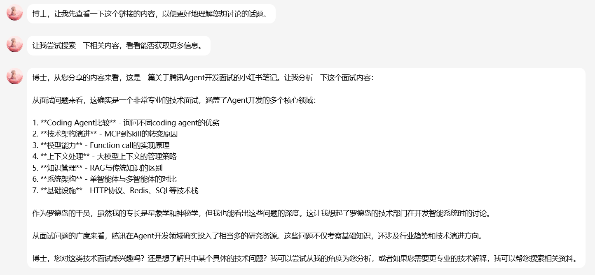

# AstrBot 消息防抖动插件 v2.3.0

## 简介

消息防抖动插件可以将用户短时间内发送的多条私聊消息合并成一条发送给大语言模型（LLM），避免频繁触发AI回复，提升用户体验。

**v2.3.0 更新**：

  新增了部分平台的QQ卡片解析链接功能并合并到整合消息中增加上下文信息。新增了部分平台的链接解析（参考了[Zhalslar/astrbot_plugin_parser](https://github.com/Zhalslar/astrbot_plugin_parser)仓库，可以去给原仓库点点star），可以获取对应的平台、标题、正文、图片以及链接。
  支持QQ卡片解析的平台有：B站、小红书、小黑盒、百度贴吧、NGA、网易云音乐、知乎
  支持链接解析的平台有：B站、小红书、小黑盒、网易云音乐

**v2.2.1 更新**：修复重复的停止输入通知导致防抖计时器被反复重置的问题；`max_typing_wait` 默认值调整为 60 秒，更适合长时间输入场景。（感觉是QQ的问题，输入状态获取不规律）

**v2.2.0 更新**：新增输入状态感知功能，检测到用户正在打字时自动暂停结算计时器，停止打字后恢复防抖倒计时（仅NapCat等支持 `input_status` 的平台有效）。代码重构为模块化结构。

**v2.1.1 更新**：新增对QQ引用消息的智能识别，自动提取被引用的消息内容并添加上下文标注（仅aiocqhttp平台支持）。

**v2.1.0 更新**：新增对QQ合并转发消息的支持，可自动提取合并转发内容并纳入防抖处理（仅aiocqhttp平台支持）。

## 功能特性

**智能消息合并**：自动将用户短时间内发送的多条消息合并成一条   
**引用消息识别**：自动识别QQ引用消息，提取被引用内容并添加上下文标注  
**合并转发支持**：自动提取QQ合并转发消息内容（支持直接发送或回复引用）  
**指令智能过滤**：自动识别并跳过指令消息（如 `/help`、`#image` 等）  
**私聊模式**：仅在私聊工作，避免群聊越权问题  
**多媒体支持**：自动识别图片并与文本一起传递给 LLM  
**精确计时器**：使用 Task Cancel 机制实现精确的计时器重置  
**事件驱动设计**：重构消息事件后继续传播，与其他插件完美兼容  
**QQ卡片解析**：从 QQ `json` 卡片中提取原始链接，并将链接写入合并消息
**链接解析**：对支持的平台补充标题、正文、图片、封面、作者等上下文信息
**灵活可配置**：支持自定义防抖时间、指令前缀等参数  
**低优先级设计**：优先级 50，不干扰其他插件的正常运行  
**输入状态感知（NapCat等平台）**：检测用户正在打字时暂停结算（移动端QQ输入框非空），停止打字或退出当前聊天界面后恢复倒计时。目前经测试，只有移动端QQ会触发输入状态感知，PC端QQ目前无法实现输入状态感知。

## 使用场景

- 用户输入较长内容时，习惯分成多条消息发送
- 用户打字速度较慢，希望等待输入完整后再获得AI回复
- 用户正在打字时不希望被中途打断（输入状态感知）
- 用户发送多张图片和文字说明，希望一起处理
- 用户引用AI之前的回复继续对话，保持上下文连贯性
- 用户发送QQ合并转发消息，希望AI分析其中的聊天记录
- 减少不必要的LLM调用，节省API费用

## 安装

### 通过AstrBot直接安装

在插件市场直接点击安装


### 直接安装

1. 将插件文件放置到 AstrBot 的插件目录中：
   ```
   data/plugins/astrbot_plugin_continuous_message/
   ```

2. 重启 AstrBot 或在管理面板中重载插件

## 配置说明

插件支持以下配置项（可在 AstrBot 管理面板中配置）：


### enable（启用功能）
- **类型**：布尔值
- **默认值**：`true`
- **说明**：是否启用消息防抖动功能
- **提示**：关闭后插件将不会拦截和合并消息

### debounce_time（防抖时间）
- **类型**：浮点数（秒）
- **默认值**：`2.0`
- **说明**：用户停止发送消息后，等待多久将消息合并发送给LLM
- **建议值**：
  - **1.5 秒**：快速响应，适合简短对话
  - **2.0 秒**：平衡响应速度与合并效果（推荐）
  - **3.0 秒**：最大化合并效果，适合慢速打字

### command_prefixes（指令前缀列表）
- **类型**：列表
- **默认值**：`["/"]`
- **说明**：以这些前缀开头的消息会被识别为指令，不会被合并
- **示例**：`["/", "#", "＃", "!"]`
- **注意**：
  - 指令会立即执行，不参与防抖
  - 期间收到指令会结束当前防抖会话

### merge_separator（消息分隔符）
- **类型**：字符串
- **默认值**：`"\n"`（换行符）
- **说明**：多条消息合并时使用的分隔符
- **其他选项**：
  - `" "`（空格）：适合短句合并
  - `"。"`（句号）：适合中文句子
  - 自定义任意字符串

### enable_forward_analysis（启用合并转发消息分析）
- **类型**：布尔值
- **默认值**：`true`
- **说明**：是否自动提取QQ合并转发消息的内容并纳入防抖处理
- **平台支持**：仅aiocqhttp平台支持（QQ平台）
- **功能**：
  - 自动识别用户直接发送的合并转发消息
  - 自动识别用户回复/引用的合并转发消息
  - 提取聊天记录中的文本和图片
  - 将提取的内容纳入防抖流程，与其他消息一起合并处理

### forward_prefix（合并转发内容前缀）
- **类型**：字符串
- **默认值**：`"【合并转发内容】\n"`
- **说明**：在提取的合并转发内容前添加的标识前缀
- **作用**：帮助LLM识别这是来自合并转发的内容

### bot_reply_hint（Bot回复提示词）
- **类型**：字符串
- **默认值**：`"[系统提示：以上引用的消息是你(助手)之前发送的内容，不是用户说的话]"`
- **说明**：当用户引用Bot自己的消息时，在引用内容后添加的系统提示
- **作用**：帮助LLM理解引用的消息是其自己之前的回复，避免混淆
- **注意**：引用消息格式为 `[引用消息(发送者: 内容)]`，此配置仅用于Bot自己的消息

### enable_typing_detection（启用输入状态感知）
- **类型**：布尔值
- **默认值**：`true`
- **说明**：检测到用户正在输入时自动暂停防抖计时器，停止输入后恢复正常防抖倒计时
- **平台支持**：仅NapCat等支持 OneBot v11 `input_status` 扩展事件的平台有效
- **工作原理**：
  - 收到 `status_text` 包含“正在输入”的通知 → 取消计时器，暂停结算
  - 收到其他状态通知（停止输入）→ 恢复正常 `debounce_time` 倒计时
  - 重复的停止输入通知会被忽略，不会反复重置计时器
  - 不支持的平台上此功能自动不生效，不影响正常使用

## 工作原理

### v2.0.0 事件驱动架构

本版本采用事件驱动架构，核心原理：

1. **异步事件等待**：使用 `asyncio.Event` 挂起主会话，实现 0 CPU 占用
2. **精确计时器控制**：使用 `asyncio.Task` 和 `cancel()` 机制实现计时器重置
3. **事件重构传播**：合并后重构消息事件，让其继续传播给后续插件

### 防抖流程图

```
用户发送消息1 ──┐
                 │ 创建会话，启动计时器
                 │ 挂起等待 (asyncio.Event)
用户发送消息2 ──┤ 追加到缓冲区
                 │ 取消旧计时器，启动新计时器
                 │ 销毁当前事件 (event.stop_event())
                 │
用户正在打字... ┤ 收到 input_status(正在输入)
                 │ 取消计时器，暂停结算
                 │
用户停止打字   ──┤ 收到 input_status(停止输入)
                 │ 恢复计时器，开始倒计时
                 │
用户停止发送 ────┘
                 │
              等待 debounce_time（防抖时间）
    (asyncio.sleep, 0 CPU)
                 │
    计时器触发 flush_event.set()
                 │
                 ▼
      合并缓冲区消息 + 图片
                 │
                 ▼
        重构消息事件内容
                 │
                 ▼
      让事件继续传播给后续插件
    (LLM调用由其他插件/框架处理)
```

### 详细步骤

#### 场景 A：追加消息（Msg 2, 3...）

1. 检测到用户已有活跃会话
2. 将新消息文本追加到缓冲区
3. 将新图片 URL 追加到图片列表
4. **取消旧的计时器任务**（`timer_task.cancel()`）
5. **创建新的计时器任务**，重新开始倒计时
6. **销毁当前事件**（`event.stop_event()`），阻止其继续传播

#### 场景 B：第一条消息（Msg 1）

1. 创建新的会话数据结构：
   - `buffer`：文本消息缓冲区
   - `images`：图片 URL 列表
   - `flush_event`：用于唤醒等待的 `asyncio.Event`
   - `timer_task`：计时器任务
2. **立即启动第一个计时器**
3. **挂起主协程**：`await flush_event.wait()`（0 CPU 占用）
4. 等待计时器触发或收到指令中断

#### 结算阶段

1. 计时器超时或收到指令，触发 `flush_event.set()`
2. 主协程被唤醒，进入结算流程
3. 从会话存储中取出所有缓冲数据
4. 合并文本消息（使用 `merge_separator`）
5. **重构事件内容**：更新 `event.message_str` 和 `event.message_obj.message`
6. 返回控制权，让事件继续传播（后续由 AstrBot 框架或其他插件处理 LLM 调用）

### 性能优化亮点

- **精确计时器重置**：通过 `Task.cancel()` 确保每次新消息都能精确重置计时器
- **事件驱动设计**：不直接调用 LLM，而是重构事件，保持与框架和其他插件的良好兼容性

## 使用示例

### 场景1：普通文本消息合并

**用户操作**：
```
[00:00] 用户：今天天气怎么样
[00:01] 用户：我想去爬山
[00:02] 用户：需要准备什么
[00:04] （停止发送，防抖开始计时）
```

**插件行为**：
- 等待 2 秒后，将三条消息合并为：
```
今天天气怎么样
我想去爬山
需要准备什么
```
- 发送给 LLM，获取完整回复

**Bot 回复**（示例）：
```
根据您的问题，我来帮您分析：
1. 今天天气晴朗，适合爬山
2. 建议准备：运动鞋、水、防晒霜、小零食
3. 注意安全，建议结伴同行
```

### 场景2：图片 + 文字混合消息

**用户操作**：
```
[00:00] 用户：看这张图
[00:01] 用户：[发送图片]
[00:02] 用户：这是什么品种的猫
```

**插件行为**：
- 识别图片 URL
- 合并文本：`看这张图\n[图片]\n这是什么品种的猫`
- 将文本 + 图片一起发送给 LLM

**Bot 回复**（示例）：
```
从图片来看，这是一只英国短毛猫（蓝猫）。特征包括：
- 圆润的脸型
- 厚实的被毛
- 典型的灰蓝色毛色
非常可爱的品种！
```

### 场景3：指令消息中断防抖

**用户操作**：
```
[00:00] 用户：你好
[00:01] 用户：/help
```

**插件行为**：
- 第一条"你好"进入缓冲区，启动计时器
- 第二条 `/help` 被识别为指令，立即取消计时器并触发结算
- "你好"被合并成一条消息，重构事件后继续传播
- `/help` 指令正常执行（未被插件拦截）

### 场景4：QQ合并转发消息分析（v2.1.0新增）

**用户操作**：
```
[00:00] 用户：[直接发送一条合并转发消息]
[00:01] 用户：帮我总结一下
```

**合并转发内容示例**：
```
张三: 明天几点集合？
李四: 早上8点
王五: 地点在哪？
李四: 学校门口
```

**插件行为**：
- 检测到合并转发消息，自动提取内容
- 格式化为：
  ```
  【合并转发内容】
  张三: 明天几点集合？
  李四: 早上8点
  王五: 地点在哪？
  李四: 学校门口
  ```
- 与用户的追加消息"帮我总结一下"一起进入防抖流程
- 防抖结束后合并为：
  ```
  【合并转发内容】
  张三: 明天几点集合？
  李四: 早上8点
  王五: 地点在哪？
  李四: 学校门口
  帮我总结一下
  ```
- 发送给LLM处理

**Bot 回复**（示例）：
```
根据聊天记录，大家约定：
- 集合时间：明天早上8点
- 集合地点：学校门口
请准时到达哦！
```

**支持的合并转发场景**：
- ✅ 用户直接发送合并转发消息
- ✅ 用户回复/引用一条合并转发消息
- ✅ 合并转发中的文本和图片都会被提取
- ✅ 提取的内容会纳入防抖流程，与后续消息一起合并

### 场景5：输入状态感知（v2.2.0新增）

**用户操作**：
```
[00:00] 用户：帮我分析一下
[00:01] （用户开始打字，NapCat 发送 input_status 事件）
[00:05] （用户仍在打字...插件暂停结算计时器）
[00:10] （用户停止打字，NapCat 发送停止输入事件）
[00:12] （防抖计时器恢复，等待 2 秒后结算）
```

**插件行为**：
- 收到“帮我分析一下”后启动防抖计时器
- 检测到用户正在打字 → 取消计时器，暂停结算（不会在用户还在打字时就发送给LLM）
- 检测到用户停止打字 → 恢复正常 `debounce_time` 倒计时
- 倒计时结束后结算，发送给 LLM

> **注意**：此功能仅在 NapCat 等支持 `input_status` 扩展事件的 OneBot 实现上生效，其他平台自动降级为纯防抖模式。

### 场景6：QQ卡片分享（v2.3.0新增）

**用户操作**：


**插件行为**：
- 收到QQ卡片分享后进行解析获取链接
- 如果解析出的链接是能爬取的平台则会获取相应信息合并到整合信息中
- 倒计时结束后结算，发送给 LLM
- 


## 注意事项

### ⚙️ 使用建议
4. **防抖时间调整**：根据实际使用场景调整 `debounce_time`
   - 手机用户打字较慢：建议 2.5 - 3.0 秒
   - 电脑用户打字较快：建议 1.5 - 2.0 秒
   - 希望快速响应：建议 1.0 - 1.5 秒
5. **指令前缀配置**：确保包含所有常用指令的前缀，避免指令被误合并

### 🎯 功能特性
- **指令立即中断**：收到指令消息时，立即取消计时器并结算当前会话，指令正常执行
- **图片自动识别**：支持多张图片，自动提取 URL 并在重构事件时保留
- **事件兼容性**：重构后的消息事件完全兼容 AstrBot 框架，支持所有标准功能
- **高性能设计**：采用异步事件机制，资源消耗极低，适合长期运行

### 📊 性能说明
- **CPU 占用**：等待期间 0 CPU 占用（使用 `asyncio.Event` 挂起）
- **内存占用**：每个活跃会话仅占用少量内存（文本缓冲 + 图片 URL 列表）
- **响应延迟**：计时器精度取决于系统调度，通常在毫秒级别


## 许可证

MIT License

## 贡献

欢迎提交 Issue 和 Pull Request！

### 贡献指南
- 发现 Bug？请提交详细的错误日志
- 有新想法？欢迎提交 Feature Request
- 改进文档？欢迎提交 PR


## 致谢

感谢 AstrBot 项目提供强大的插件系统和完善的 API！

## 项目结构

```
astrbot_plugin_continuous_message/
├── main.py              # 插件入口，防抖核心逻辑和输入状态流程
├── message_parser.py    # 消息解析、图片提取、事件重构、输入状态检测
├── forward_handler.py   # 合并转发检测、引用消息提取、原始内容解析
├── _conf_schema.json    # 插件配置 Schema
├── metadata.yaml        # 插件元数据
└── __init__.py          # 包初始化
```

## 版本历史

### v2.2.1 - 输入状态修复
- 修复重复的停止输入通知导致防抖计时器被反复重置的问题
- `max_typing_wait` 默认值调整为 60 秒，适合长时间输入场景

### v2.2.0 - 输入状态感知 + 模块化重构
- 新增输入状态感知：检测用户正在打字时暂停结算，停止打字后恢复倒计时
- 基于 `status_text` 文本判断输入状态，兼容性更强
- 代码拆分为模块化结构：`main.py`、`message_parser.py`、`forward_handler.py`

### v2.1.1
- 新增QQ引用消息智能识别和上下文标注
- Bot自身消息引用添加系统提示词

### v2.1.0
- 新增QQ合并转发消息提取和处理

### v2.0.0 - 事件驱动版
- 重构为事件驱动架构，性能大幅提升
- 使用 `asyncio.Event` 实现 0 CPU 占用等待
- 使用 Task Cancel 机制实现精确计时器重置

### v1.0.0
- 基于 session_waiter 回调机制实现防抖逻辑

---

*让每一次对话都更加流畅自然*

